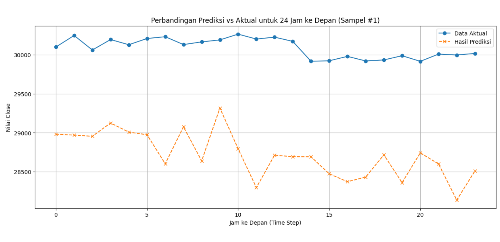
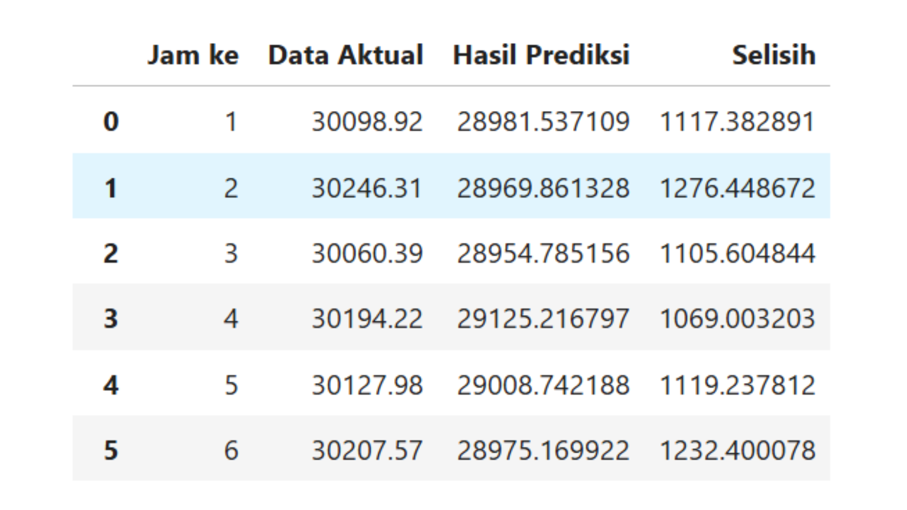

# Kriteria Submission
Link dataset: https://drive.google.com/file/d/1hpsqSpfjdqIZWqwd259klQSeaNSe5Trr/view?usp=sharing

Kriteria 1: Mempersiakan Data dan Membangun Model Baseline
Menggunakan minimal 3 fitur sebagai input ke Model Forecasting.
- Melakukan Eksplorasi Data Analysis dengan membuat heatmap korelasi antar fitur yang dipilih.
- Pastikan tidak terjadi data leakage saat melakukan normalisasi atau standardisasi pada data.
- Berhasil membangun model LSTM dasar sebagai baseline dan melatihnya menggunakan model.fit().

Advanced (4 pts)
- Semua ketentuan  Skilled terpenuhi.
- Menentukan window size berdasarkan hasil analisis lag pada data (Uji ACF dan PACF). Pastikan juga untuk memvisualisasikan plot hasil Uji ACF dan PACF.
- Melakukan feature engineering dengan membuat setidaknya satu fitur baru menggunakan Rolling Statistic.

Kriteria 2: Membangun Arsitektur Model Kustom
- Membangun model baru, Seq2Seq LSTM dengan pendekatan Teacher Forcing menggunakan Functional API.
- Membuat ulang satu layer Dense dari nol dengan Custom Layer.
- Memastikan model LSTM dan Seq2Seq LSTM ditujukan untuk multi-step time series forecasting sebanyak 24 step.

Advanced (4 pts)
- Semua ketentuan Skilled terpenuhi.
- Menambahkan satu custom layer yang secara spesifik membuat ulang layer Multi Head Attention dan digunakan pada model baseline LSTM serta Seq2Seq LSTM.
- Membuat ulang satu atau lebih lagi custom layer. Berikut beberapa opsi custom layer yang Anda dapat buat:
    - Dropout layer
    - Normalization layer
    - Activation function layer (Elu, Leaky Relu, dll)

Kriteria 3: Membuat Pelatihan Kustom
- Membangun Custom Training dengan tf.GradientTape
- Loop Training berjalan dengan menampilkan jumlah epoch, loss, dan val loss.
- Melakukan inference prediksi pada data test menggunakan model LSTM dan Seq2Seq LSTM (Khusus untuk Seq2Seq gunakan teknik Autoregressive). Pastikan untuk memvisualisasikan hasil prediksi dalam bentuk plot line chart prediksi dan tabel perbandingan data aktual dengan hasil prediksi
Contoh plot line chart prediksi:

Contoh tabel perbandingan data aktual dengan hasil prediksi (optional: tambahan kolom "selisih"):

Advanced (4 pts)
- Semua ketentuan  Skilled terpenuhi.
- Membuat Custom Loss yang menambahkan weight loss pada horizon atau step yang lebih jauh dan menggunakannya pada Custom Training.
Contoh :
    - Error pada step ke-1 dikalikan bobot w_1 (misal: 1.0)
    - Error pada step ke-2 dikalikan bobot w_2 (misal: 1.2)
    - Error pada step ke-3 dikalikan bobot w_3 (misal: 1.4)
    dst.
- Membuat Custom Callback yang dapat mengurangi learning rate secara bertahap saat validation loss-nya stagnan selama beberapa epoch dan menggunakannya pada Custom Training.
- Performa model Custom Seq2Seq LSTM saat dievaluasi pada data test di bawah 0,015 MAE (kondisi sebelum di inverse scaled).

Kriteria yang di tolak
1. Proyek time series yang dibuat adalah single-step dan univariate atau bivariate time series.
2. Tidak membuat Model Sequence to Sequence menggunakan custom model (functional API atau sub classing)
3. Tidak membagi data menjadi tiga kategori (train, validation, dan test)
4. Tidak menampilkan atau menghitung nilai MAE pada data test sebagai metrik evaluasi utama.
5. Terjadi kebocoran data (data leakage), di mana informasi dari data validasi atau data test masuk ke dalam proses training (contoh: melakukan scaling pada keseluruhan data sebelum dibagi).

# Kriteria File & Folder
DLTM_Nama-siswa
├── Nama_Submission_Akhir_DLTM.ipynb
├── model_baseline_LSTM.keras
├── model_seq2seq_LSTM.keras
├── best_model_seq2seq_LSTM.keras (Opsional)
├── requirements.txt