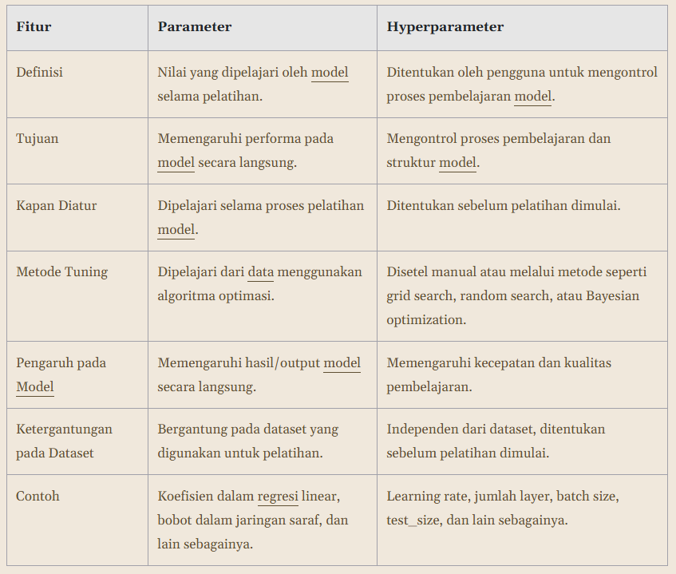

Hyperparameter tuning merupakan langkah yang sangat penting untuk menghasilkan model machine learning yang andal. Tujuan utama hyperparameter tuning adalah untuk menemukan keseimbangan yang tepat antara bias dan varians (bias-variance tradeoff) sehingga model mampu mempelajari pola dengan baik tanpa kehilangan kemampuan untuk menggeneralisasi pada data baru.

Parameter vs Hyperparameter

Cara untuk mengidentifikasi dan mengatur prioritas dalam tuning
1. Penggunaan Default Hyperparameter: Pada tahap awal dapat memberikan baseline yang cukup baik sebelum mulai melakukan tuning secara manual maupun otomatis.
2. Memahami Algoritma yang Digunakan:
    - Regresi Linier / Regresi Logistik: Regularisasi (L2 atau L1) dan C atau lambda adalah hyperparameter utama yang perlu diperhatikan.
    - K-Nearest Neighbors (KNN): Jumlah tetangga terdekat (k) dan jarak metrik (Euclidean, Manhattan) adalah hyperparameter yang paling penting.
    - Decision Tree: Kedalaman pohon (max_depth), jumlah sampel minimum untuk membagi simpul (min_samples_split), dan criterion (impurity measure seperti Gini atau Entropy) sangat memengaruhi performa model.
    - Random Forest: Jumlah pohon (n_estimators), kedalaman pohon (max_depth), dan ukuran minimum sampel di setiap daun (min_samples_leaf) adalah hyperparameter yang perlu dipertimbangkan.
    - Support Vector Machine (SVM): Regularisasi parameter (C) dan jenis kernel (linear, rbf, polynomial), serta parameter kernel seperti gamma (untuk rbf kernel) sangat penting.
    - Neural Networks (Jaringan Saraf Tiruan): Jumlah lapisan tersembunyi (hidden layer), jumlah neuron (units) di setiap lapisan, learning rate, batch size, dan optimizer sangat memengaruhi kinerja model.
3. Identifikasi Hyperparameter yang Paling Berpengaruh: Tidak semua hyperparameter memiliki pengaruh besar terhadap performa model. Fokus pada hyperparameter yang paling penting akan menghemat waktu dan sumber daya selama proses tuning.
4. Prioritaskan Tuning Hyperparameter yang Krusial: Tidak mencoba menyetel semua hyperparameter sekaligus, tetapi memfokuskan eksplorasi pada hyperparameter yang berpotensi memberikan dampak paling besar terlebih dahulu.
5. Memahami Hubungan antara Hyperparameter: Beberapa hyperparameter memiliki hubungan yang saling terkait sehingga pengaruhnya pada model tergantung pada pengaturan hyperparameter lainnya. Misalnya, dalam jaringan saraf tiruan, learning rate dan momentum sering kali berinteraksi bersamaan. Dengan melakukan tuning salah satu hyperparameter tanpa mempertimbangkan yang lain, dapat menyebabkan kinerja buruk karena keduanya saling berkaitan.
6. Menyesuaikan Hyperparameter Berdasarkan Data: Beberapa pertimbangan yang biasanya dilakukan yaitu seperti berikut.
  - Ukuran Dataset: pada dataset besar, batch size yang lebih besar bisa membuat pelatihan lebih efisien. Sementara pada dataset kecil, batch size yang kecil mungkin lebih tepat untuk mencegah overfitting.
  - Dimensi Data: pada dataset berdimensi tinggi, model seperti SVM sering kali membutuhkan tuning yang lebih intensif pada hyperparameter gamma untuk menangani kompleksitas data.
  - Jumlah Noise: jika data mengandung banyak noise, regularization parameter misalnya C pada SVM atau alpha pada Ridge Regression mungkin harus diperhatikan supaya terhindar dari overfitting.  
7. Evaluasi Kinerja Model dengan Cross-Validation: perlu melakukan evaluasi kinerja model secara menyeluruh

Salah satu hyperparameter paling penting dalam banyak algoritma machine learning terutama dalam jaringan saraf tiruan dan gradient-based learning adalah learning rate. Learning rate menentukan seberapa besar langkah yang diambil oleh algoritma optimasi setiap kali memperbarui bobot atau parameter model berdasarkan gradient error.

Nilai learning rate yang cenderung besar dapat menyebabkan model belajar terlalu cepat sehingga memungkinkan model melewati performa optimal. Hal ini dapat menyebabkan osilasi dalam proses optimasi, di mana model tidak dapat menemukan titik minimum dari fungsi kerugian (loss function).

Sebaliknya, jika Anda mengatur nilai learning rate terlalu kecil akan menyebabkan pelatihan menjadi sangat lambat karena langkah yang terlalu kecil untuk menghasilkan perubahan sehingga tidak memberikan pembaharuan yang signifikan pada parameter

Parameter selanjutnya yaitu ukuran dari batch_size yang Anda tentukan. Parameter ini memiliki peran yang cukup krusial karena berdampak terhadap penggunaan memori dari komputer yang Anda gunakan. Batch size adalah jumlah sampel yang diproses sebelum model memperbarui bobotnya dalam setiap iterasi pelatihan.
    - Batch size yang besar Memberikan estimasi gradient yang lebih stabil dan cenderung membuat pembaruan bobot lebih halus dan stabil. Membutuhkan lebih banyak memori dan waktu komputasi, tetapi dapat mempercepat proses pelatihan dalam hal iterasi per epoch.
    - Batch size yang kecil Memperbarui bobot lebih sering sehingga memberikan perubahan parameter yang lebih granular dan memungkinkan model untuk lebih cepat merespons terhadap setiap data sampel. Pelatihan menjadi lebih tidak stabil, karena setiap batch kecil dapat menghasilkan estimasi gradient yang sangat bervariasi. Membutuhkan lebih sedikit memori sehingga cocok untuk sistem dengan keterbatasan memori.

Epoch adalah jumlah perulangan yang dilakukan selama proses pelatihan model machine learning atau deep learning.
    - Ketika Anda mengatur jumlah epochs terlalu kecil, model cenderung memiliki performa yang tidak cukup baik. Hal ini dapat menyebabkan underfitting karena parameter belum mencapai nilai optimal. 
    - Sebaliknya, Anda juga tidak dapat mengatur epochs setinggi-tingginya karena model berpotensi overfitting pada data pelatihan karena terus belajar bahkan setelah mencapai titik optimal. Ini akan membuat model kurang mampu menggeneralisasi pada data baru.

Grid Search: metode hyperparameter tuning yang digunakan untuk menemukan kombinasi hyperparameter optimal pada model machine learning. Grid Search bekerja dengan mencoba semua kombinasi dari nilai hyperparameter yang telah Anda tentukan dan mengevaluasi performa model untuk setiap kombinasi tersebut. Tujuan dari Grid Search adalah untuk mengidentifikasi set hyperparameter yang menghasilkan performa terbaik berdasarkan metrik evaluasi yang dipilih (misalnya akurasi, F1-score, atau MSE).

Metode Grid Search sebenarnya memiliki tahapan yang sederhana layaknya pencarian manual. Alih-alih mengubah satu per satu hyperparameter dan melatih model, Grid Search akan melakukan semua tahapan secara otomatis. Kurang lebih tahapan yang dilakukan Grid Search mencakup hal berikut.
- Menentukan Ruang Hyperparameter: pengguna menentukan hyperparameter yang ingin diatur dan menetapkan rentang nilai untuk setiap hyperparameter. Nilai-nilai ini akan membentuk grid (sebuah "tabel kombinasi" dari semua kemungkinan).
- Mencoba Semua Kombinasi: Grid Search mencoba semua kombinasi hyperparameter yang mungkin, melatih model dengan setiap kombinasi tersebut, dan mengevaluasi performa berdasarkan metrik tertentu.
- Memilih Kombinasi Terbaik: setelah semua kombinasi diuji, Grid Search akan memilih kombinasi hyperparameter yang menghasilkan performa terbaik.

Random Search: metode hyperparameter tuning yang memilih beberapa kombinasi hyperparameter secara acak dari ruang pencarian yang sudah ditentukan. Proses ini memungkinkan model untuk diuji dengan kombinasi acak yang dipilih secara independen untuk setiap iterasi. 

Tujuan Random Search adalah menghemat waktu dan sumber daya dengan tetap melatih sejumlah kombinasi yang cukup representatif dari ruang pencarian, tanpa perlu menguji semua kombinasi yang mungkin terjadi.

Kelebihan Random Search.
- Efisiensi Waktu: pada penggunaan Grid Search komputer akan menguji semua kombinasi. Namun, dengan Random Search, Anda bisa menentukan untuk mencoba sebagian dari kombinasi tersebut misalnya 10, 20, 30, atau x kombinasi.
- Kecepatan Komputasi: Random Search lebih cepat jika waktu dan sumber daya komputasi terbatas, karena kita hanya mencoba sejumlah iterasi yang sudah ditetapkan.
- Fleksibilitas: kita dapat mengontrol seberapa banyak kombinasi yang ingin diuji tanpa perlu menguji setiap kemungkinan kombinasi sehingga bisa menghemat waktu. Kekurangannya, Anda bisa saja kehilangan peluang untuk menemukan kombinasi hyperparameter terbaik.

Random Search juga memiliki keterbatasan seperti berikut.
- Tidak Menjamin Hasil Terbaik: karena hanya beberapa kombinasi yang diuji, tidak ada jaminan bahwa Random Search akan menemukan kombinasi hyperparameter terbaik.
- Ketergantungan pada Jumlah Iterasi: semakin sedikit iterasi yang dilakukan, semakin kecil kemungkinan Random Search menemukan hyperparameter yang optimal. Jika n_iter terlalu kecil, kemungkinan mendapatkan hasil suboptimal lebih besar.

Bayesian Optimization adalah teknik hyperparameter tuning yang digunakan untuk menemukan kombinasi hyperparameter yang optimal dengan melakukan lebih sedikit percobaan dibandingkan Grid Search atau Random Search. 

Bayesian Optimization sangat berguna untuk masalah yang memerlukan tuning hyperparameter pada ruang pencarian yang besar, di mana mencoba semua kombinasi hyperparameter akan sangat tidak efisien dan memakan waktu. Bayesian Optimization tidak melakukan pencarian secara acak atau mencoba semua kombinasi, melainkan menggunakan pendekatan probabilistik untuk secara cermat memilih kombinasi hyperparameter yang paling mungkin memberikan hasil terbaik berdasarkan percobaan sebelumnya.

Bayesian Optimization menggunakan model probabilistik yang disebut surrogate model untuk memperkirakan fungsi objektif yang tidak diketahui. Model surrogate biasanya adalah Gaussian Process (GP) atau kadang Random Forest.

Bayesian Optimization menggunakan fungsi akuisisi untuk menentukan hyperparameter mana yang akan diuji pada iterasi berikutnya. Fungsi akuisisi menentukan trade-off antara eksploitasi dan eksplorasi. Mari kita bahas sedikit terkait kedua nilai trade-off tersebut.
- Eksploitasi: mencoba kombinasi hyperparameter yang sudah diketahui memberikan hasil yang baik (berdasarkan model probabilistik).
- Eksplorasi: mencoba kombinasi hyperparameter baru yang belum pernah diuji sebelumnya.

Fungsi akuisisi yang umum digunakan antara lain:
- Expected Improvement (EI): memilih kombinasi hyperparameter yang paling mungkin memberikan peningkatan performa yang signifikan dibandingkan dengan performa terbaik yang sudah diketahui.
- Probability of Improvement (PI): memilih kombinasi hyperparameter yang paling mungkin memberikan peningkatan performa dibandingkan dengan performa terbaik yang sudah diketahui.
- Upper Confidence Bound (UCB): memilih kombinasi hyperparameter yang memiliki nilai expected improvement tertinggi.

Kelebihan Bayesian Optimization:
- Efisiensi: membutuhkan lebih sedikit percobaan dibandingkan Grid Search atau Random Search.
- Fleksibilitas: dapat digunakan untuk ruang pencarian yang besar.
- Adaptif: dapat menyesuaikan strategi pencarian berdasarkan hasil percobaan sebelumnya.
- Fleksibel untuk Ruang Pencarian Kompleks: memperkirakan hasil, ia dapat mengeksplorasi dan mengeksploitasi ruang pencarian dengan lebih efisien.
- Kemampuan Menangani Ketidakpastian: tidak hanya memberikan perkiraan nilai kinerja model, tetapi juga membantu mengurangi kesalahan dalam prediksi.

Kekurangan Bayesian Optimization:
- Kompleksitas: lebih kompleks untuk diimplementasikan dibandingkan Grid Search atau Random Search.
- Ketergantungan pada model surrogate: performa Bayesian Optimization bergantung pada kualitas model surrogate yang digunakan.
- Ketergantungan pada fungsi akuisisi: performa Bayesian Optimization bergantung pada kualitas fungsi akuisisi yang digunakan.
- Waktu Komputasi untuk Gaussian Process: waktu komputasi untuk membangun dan memperbarui model Gaussian Process bisa meningkat ketika jumlah hyperparameter dan datanya juga meningkat.
- Efisiensi Berkurang untuk Hyperparameter dalam Dimensi Tinggi: menjadi kurang efisien karena model probabilistik cenderung bekerja lebih baik pada ruang pencarian yang lebih kecil atau dengan dimensi yang lebih rendah. 
